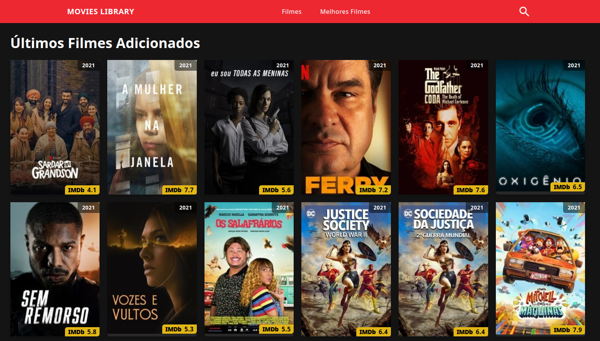
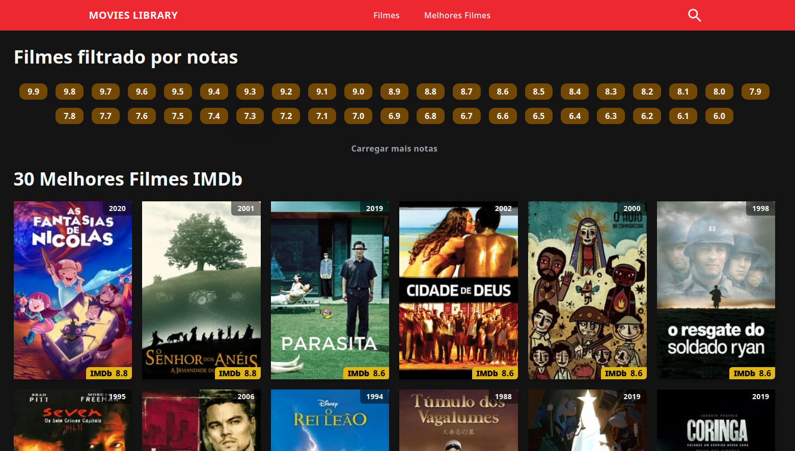
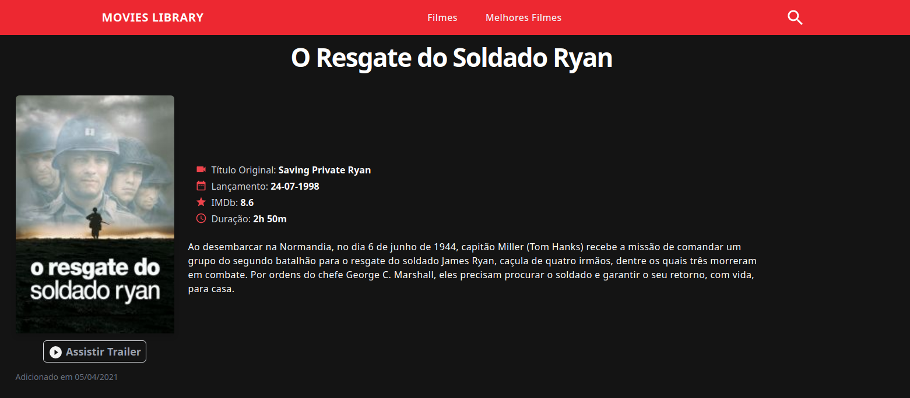
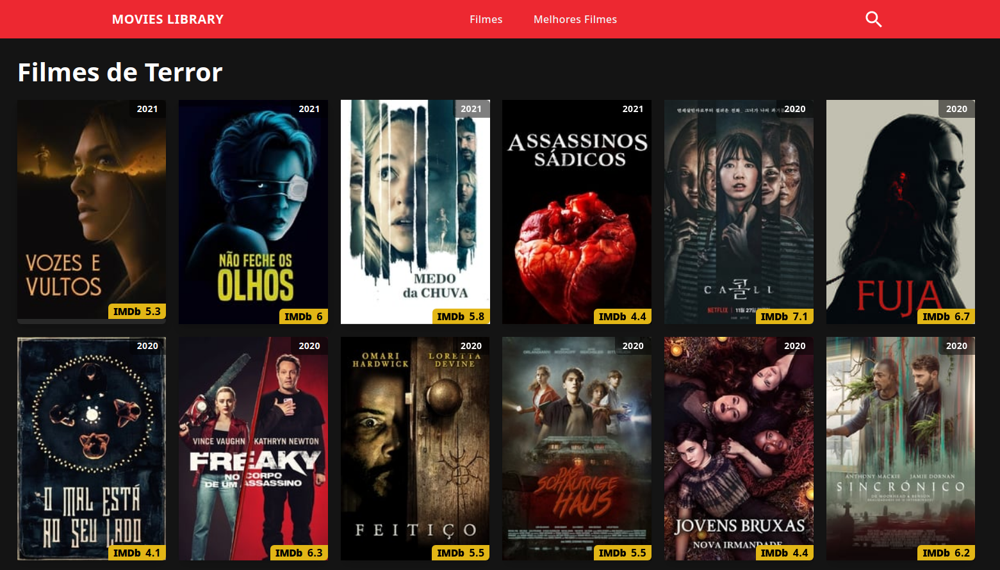
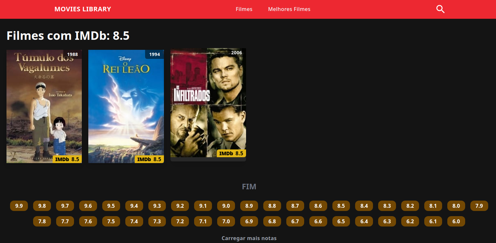
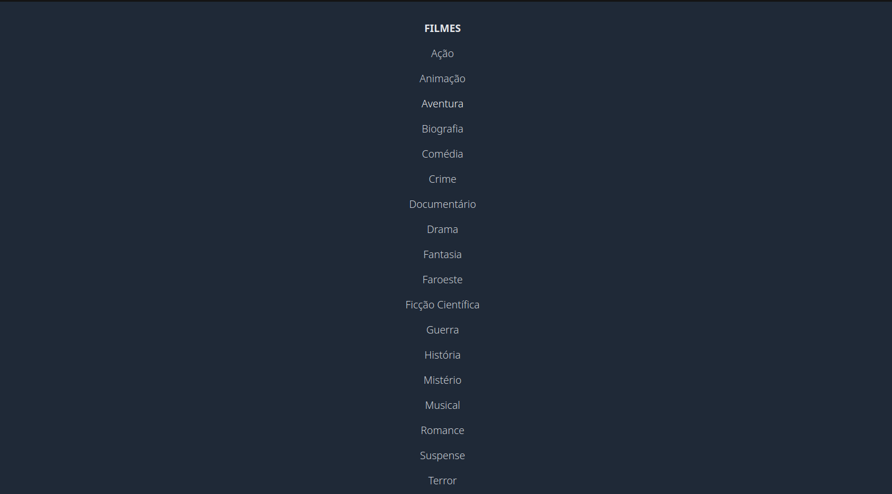

# A Movie Library Site

<p align="center">
  <a href="#about">About the Project</a> •
  <a href="#demo">Demo</a> •
  <a href="#screenshots">Screenshots</a> •
  <a href="#how-to-use">How To Use</a> •
  <a href="#how-to-reach-me">How to reach me</a>
</p>



<!-- ## Contents

- [About the Project](#about)
- [Demo](#demo)
- [Screenshots](#screenshots)
- [How to use](#how-to-use)
- [How to reach me](#how-to-reach-me) -->

## About the project <a name="about"/>
- On this site you can:
  - Browse the latest added movies
  - Browse by movie genre
  - Browse by IMDb ratings
  - Search movie by its title
  - View the top 30 movies

#### Front-end
<div style="display: inline block">


#### Static pages generator


</div>


## Demo

See the live preview here:  
[](https://bibliotecafilmes.netlify.app)

[https://bibliotecafilmes.netlify.app](https://bibliotecafilmes.netlify.app)


## Screenshots

### Homepage


### Best Movies


### Movie Page <a name="movie-page"/>


<details><summary><b>See More Screenshots</b></summary>  

### Movies sorted by Genre


### Movies sorted by IMDB


### Genres Menu


</details>

---

## How to use <a name="how-to-use"/>

1. Download the files
```sh
git clone https://github.com/brochj/movies-library.git
```
2. Go to the project folder
```sh
cd movies-library
```
3. Install the libraries
```sh
npm install
```
4. Build the project (_this may take a few minutes_)
```sh
npm run build
```
5. Run the project
```sh
npm run start
```

The site should be up and running on [http://localhost:3000](http://localhost:3000)!

---

### 📫 How to reach me <a name="how-to-reach-me"/>
<div> 
  <a href = "mailto:brochj@gmail.com"></a>
  <a href="https://www.linkedin.com/in/oscarbroch/" target="_blank"></a> 
</div>

### `brochj@gmail.com`